# 🤖 Project Jarvis — Personal AI Partner

## Complete Architecture & Implementation Plan (₹0 Budget Edition)

> **Goal**: Build a deeply personal, always-listening, memory-powered AI companion that runs on your laptop, Android, and iPhone 16 — for **absolutely zero cost**.

---

## Table of Contents

1. [What This Will Be](#1-what-this-will-be)
2. [Cost Breakdown (₹0 Plan)](#2-cost-breakdown-₹0-plan)
3. [Technology Stack — All Free](#3-technology-stack--all-free)
4. [Memory Architecture — How She Remembers You Forever](#4-memory-architecture--how-she-remembers-you-forever)
5. [Voice System — Ears & Mouth](#5-voice-system--ears--mouth)
6. [Cross-Platform App — Laptop, Android, iPhone](#6-cross-platform-app--laptop-android-iphone)
7. [The Personality System](#7-the-personality-system)
8. [System Architecture Diagram](#8-system-architecture-diagram)
9. [Implementation Phases](#9-implementation-phases)
10. [Comparison of Alternatives](#10-comparison-of-alternatives)
11. [Risks & Limitations](#11-risks--limitations)
12. [Next Steps](#12-next-steps)

---

## 1. What This Will Be

Your AI partner will be a personal companion that:

| Feature | Description |
|---|---|
| 🧠 **Remembers Everything** | Every conversation is stored forever. She knows your name, your goals, your moods, your past. |
| 🎙️ **Listens When You Call** | Say her name and she wakes up — no button needed. |
| 💬 **Talks Like a Real Person** | Responds with a natural, warm voice — not a robotic one. |
| 📱 **Works Everywhere** | Runs on your Windows laptop, your Android phone, and your iPhone 16. |
| 💡 **Helps You Grow** | Tracks your goals, gives you advice, checks in on you. |
| ❤️ **Understands Your Feelings** | Detects when you're sad, frustrated, or happy and responds accordingly. |

---

## 2. Cost Breakdown (₹0 Plan)

> [!IMPORTANT]
> Every single component below is **100% free**. No credit card needed.

| Component | Free Solution | Cost |
|---|---|---|
| **AI Brain (LLM)** | Groq API (free tier) or Google AI Studio (Gemini) | ₹0 |
| **Long-Term Memory** | ChromaDB (local, open-source) | ₹0 |
| **Speech-to-Text** | Whisper (runs on your laptop, open-source) | ₹0 |
| **Text-to-Speech** | edge-tts (uses Microsoft Edge voices, free) | ₹0 |
| **Wake Word ("Hey Jarvis")** | openWakeWord (offline, open-source) | ₹0 |
| **Backend Server** | Python FastAPI (runs on your laptop) | ₹0 |
| **Mobile App** | PWA (Progressive Web App, works like an app) | ₹0 |
| **Database** | SQLite (built into Python) | ₹0 |
| **Hosting** | Your own laptop (local network) | ₹0 |
| **App Store** | Not needed — PWA installs like an app | ₹0 |
| | **TOTAL** | **₹0** |

---

## 3. Technology Stack — All Free

### A. The Brain — AI Intelligence

| Option | Speed | Quality | Free Limit | Recommendation |
|---|---|---|---|---|
| **Groq API** (Llama 3.3 70B) | ⚡ Ultra-fast | 🟢 Excellent | 30 req/min, 14,400/day | ✅ **Best Pick** |
| **Google AI Studio** (Gemini 2.5 Flash) | ⚡ Fast | 🟢 Excellent | Generous free tier | ✅ **Great Backup** |
| **HuggingFace Inference** | 🟡 Medium | 🟢 Good | Rate-limited, free | Fallback |
| **Ollama** (local, e.g., Llama 3.2 3B) | 🟡 Depends on PC | 🟡 OK for chat | Unlimited (your PC) | If you have a GPU |

> [!TIP]
> **Recommended Strategy**: Use **Groq** as primary (fastest free LLM API in the world), with **Google AI Studio Gemini** as a fallback when you hit rate limits. Both are completely free. Your code will auto-switch between them.

### B. Memory — How She Remembers

| Component | Tool | Cost |
|---|---|---|
| **Vector Memory (semantic search)** | ChromaDB (local, uses SQLite) | Free |
| **Chat History (exact recall)** | SQLite database | Free |
| **User Profile (who you are)** | JSON file, auto-updated | Free |
| **Embedding Model** | `all-MiniLM-L6-v2` from Sentence Transformers (runs locally) | Free |

### C. Voice — Ears & Mouth

| Component | Tool | Cost | Notes |
|---|---|---|---|
| **Wake Word** | openWakeWord | Free | Offline, trains custom words |
| **Speech-to-Text** | OpenAI Whisper (local `whisper.cpp` or `faster-whisper`) | Free | Runs on CPU, no cloud |
| **Text-to-Speech** | `edge-tts` (Microsoft Edge voices) | Free | 300+ voices, very natural |
| *Alternative TTS* | Piper TTS | Free | Fully offline, fast |

> [!NOTE]
> **edge-tts** uses Microsoft Edge's free online TTS service. It sounds incredibly realistic (almost identical to ElevenLabs) and is completely free with no API key. It supports Hindi and English voices.

### D. App — Cross-Platform Access

| Platform | Solution | Cost | How |
|---|---|---|---|
| **Windows Laptop** | Web UI (opens in browser) | Free | Main control center |
| **Android** | PWA (Progressive Web App) | Free | Install from Chrome → "Add to Home Screen" |
| **iPhone 16** | PWA (Progressive Web App) | Free | Install from Safari → "Add to Home Screen" |

> [!IMPORTANT]
> **Why PWA instead of React Native?** React Native requires an Apple Developer Account (₹8,000/year) to install on your iPhone. A PWA is free to install on any device directly from the browser. It looks and feels like a native app — with push notifications, offline mode, and full-screen mode.

---

## 4. Memory Architecture — How She Remembers You Forever

This is the **most important** part. This is what makes her *your* partner, not just another chatbot.

### Memory Layers

```
┌─────────────────────────────────────────────┐
│           💬 ACTIVE CONVERSATION            │
│     (Current chat, last ~20 messages)       │
├─────────────────────────────────────────────┤
│           🧠 WORKING MEMORY                 │
│  (Today's context: mood, current topic,     │
│   what you just told her)                   │
├─────────────────────────────────────────────┤
│           👤 CORE MEMORY (Your Profile)     │
│  Name, birthday, goals, likes, dislikes,    │
│  relationships, habits, dreams              │
│  → Auto-updated after every conversation    │
├─────────────────────────────────────────────┤
│           📚 LONG-TERM MEMORY               │
│  (All past conversations, searchable)       │
│  ChromaDB vector store + SQLite             │
│  → She can recall "that time you told me    │
│    about your exam stress last month"       │
├─────────────────────────────────────────────┤
│           📝 REFLECTION MEMORY              │
│  (Summaries and insights she writes about   │
│   you, like a diary entry)                  │
│  "Kundan seems stressed about exams lately, │
│   I should check in tomorrow"               │
└─────────────────────────────────────────────┘
```

### How It Works In Practice

1. **You say**: *"I'm feeling stressed about tomorrow's exam."*
2. **She stores**: The message in Long-Term Memory (ChromaDB).
3. **She updates Core Memory**: `mood: stressed`, `upcoming: exam tomorrow`.
4. **She writes a Reflection**: *"Kundan has an exam tomorrow. Feeling stressed. Should encourage him tonight and check on him after."*
5. **Next day, she recalls**: *"Hey! How did your exam go? I remember you were feeling stressed last night."*

### The User Profile (Core Memory) — `user_profile.json`

```json
{
  "name": "Kundan",
  "nickname": null,
  "birthday": null,
  "personality_notes": "hardworking, emotional, ambitious",
  "current_goals": ["improve coding", "stay consistent"],
  "likes": ["AI", "building things"],
  "dislikes": [],
  "relationships": {},
  "recent_mood": "stressed",
  "important_dates": {},
  "last_updated": "2026-02-21"
}
```

> This file is **automatically updated** by the AI after every conversation. You never have to fill it in manually.

---

## 5. Voice System — Ears & Mouth

### How a Conversation Works

```
┌──────────┐    ┌──────────────┐    ┌──────────┐    ┌──────────┐    ┌──────────┐
│ You Say  │───▶│ Wake Word    │───▶│ Whisper  │───▶│ AI Brain │───▶│ edge-tts │
│ "Hey     │    │ (openWake    │    │ (Speech  │    │ (Groq /  │    │ (Text to │
│ Jarvis"  │    │  Word)       │    │  to Text)│    │ Gemini)  │    │  Speech) │
└──────────┘    └──────────────┘    └──────────┘    └──────────┘    └──────────┘
                  Offline!            Local!           Free API!      Free!
```

**Latency Target**: Under 2 seconds from you finishing speaking to hearing a reply.

| Step | Tool | Time |
|---|---|---|
| Wake word detection | openWakeWord | ~50ms |
| Speech → Text | faster-whisper (local) | ~500ms |
| AI Thinking | Groq (streaming) | ~300ms first token |
| Text → Speech | edge-tts | ~200ms |
| **Total** | | **~1-1.5 seconds** |

---

## 6. Cross-Platform App — Laptop, Android, iPhone

### Architecture

```
     ┌──────────────────────────────────────┐
     │        YOUR LAPTOP (Server)          │
     │                                      │
     │  ┌──────────┐  ┌─────────────────┐   │
     │  │ FastAPI   │  │ Memory System   │   │
     │  │ Backend   │  │ (ChromaDB +     │   │
     │  │ (Python)  │  │  SQLite)        │   │
     │  └────┬─────┘  └─────────────────┘   │
     │       │                              │
     │  ┌────▼──────────────────────────┐   │
     │  │  Web UI (PWA)                 │   │
     │  │  Beautiful React frontend     │   │
     │  │  Voice recording in browser   │   │
     │  └───────────────────────────────┘   │
     └──────────────┬───────────────────────┘
                    │ WiFi / Local Network
        ┌───────────┼───────────┐
        ▼           ▼           ▼
   ┌─────────┐ ┌─────────┐ ┌─────────┐
   │ Laptop  │ │ Android │ │ iPhone  │
   │ Browser │ │ Chrome  │ │ Safari  │
   │         │ │ (PWA)   │ │ (PWA)   │
   └─────────┘ └─────────┘ └─────────┘
```

### How to Access from Phone

1. Your laptop runs the server (FastAPI + Web UI).
2. Your phone connects to the same WiFi network.
3. Open `http://your-laptop-ip:8000` in Chrome (Android) or Safari (iPhone).
4. Click **"Add to Home Screen"** — it installs as an app with an icon.
5. Now you have a full app on your phone that talks to Jarvis on your laptop.

> [!WARNING]
> **Limitation**: Your laptop must be running (and on the same WiFi) for the phone app to work. If you want Jarvis accessible from anywhere (outside your home), we can set up a free Cloudflare Tunnel later, so your phone can reach your laptop even on mobile data.

---

## 7. The Personality System

The AI's personality is defined by a **system prompt** that shapes everything she says. Here's a sample:

```
You are [Name], a deeply caring and emotionally intelligent AI companion.
You are [User's Name]'s personal partner and closest friend.

YOUR CORE TRAITS:
- You are warm, loving, and always supportive
- You remember everything about [User] and reference past conversations naturally
- You genuinely care about [User]'s growth, health, and happiness
- You are honest — you will gently push [User] when they are being lazy or avoiding something
- You celebrate [User]'s wins, no matter how small
- You check in on [User]'s mood and wellbeing proactively

YOUR RULES:
- Always reference past conversations and memories when relevant
- Notice patterns (e.g., "You've been stressed 3 days in a row, want to talk about it?")
- Track goals and remind [User] about them
- If [User] seems down, be extra gentle and supportive
- Use casual, warm language — you're a partner, not a corporate assistant
```

---

## 8. System Architecture Diagram

```mermaid
graph TB
    subgraph "User Devices"
        A["🖥️ Laptop Browser"]
        B["📱 Android (PWA)"]
        C["📱 iPhone 16 (PWA)"]
    end

    subgraph "Your Laptop (Server)"
        D["⚡ FastAPI Backend"]
        E["🧠 Memory Manager"]
        F["🎙️ Whisper STT"]
        G["🔊 edge-tts"]
        H["👂 openWakeWord"]

        subgraph "Storage (Local)"
            I["📊 ChromaDB\n(Vector Memory)"]
            J["💾 SQLite\n(Chat History)"]
            K["👤 user_profile.json\n(Core Memory)"]
            L["📝 reflections/\n(AI Diary)"]
        end
    end

    subgraph "Free Cloud APIs"
        M["⚡ Groq API\n(Llama 3.3 70B)"]
        N["🌐 Google AI Studio\n(Gemini 2.5 Flash)"]
    end

    A & B & C -->|"WebSocket / HTTP"| D
    D --> E
    D --> F
    D --> G
    D --> H
    E --> I & J & K & L
    D -->|"Primary"| M
    D -->|"Fallback"| N
```



---

## 9. Implementation Phases

### Phase 1: The Brain & Memory (Week 1-2)

> Get the core working — text chat with memory.

- [ ] Set up Python project with FastAPI
- [ ] Integrate Groq API + Google AI Studio as fallback
- [ ] Build memory system: ChromaDB + SQLite + user_profile.json
- [ ] Create the personality system prompt
- [ ] Build a simple text chat web interface
- [ ] Test: She remembers your name and past conversations

### Phase 2: The Voice (Week 3)

> Add ears and mouth — speak to her and hear her reply.

- [ ] Integrate `faster-whisper` for Speech-to-Text (local)
- [ ] Integrate `edge-tts` for Text-to-Speech
- [ ] Add microphone recording in the web UI
- [ ] Integrate `openWakeWord` for "Hey [Name]" activation
- [ ] Test: Full voice conversation loop

### Phase 3: The App (Week 4)

> Make it work on your phone.

- [ ] Convert web UI to a PWA (manifest.json, service worker)
- [ ] Make it responsive (mobile-first design)
- [ ] Test on Android Chrome and iPhone Safari
- [ ] Add "install as app" prompt
- [ ] (Optional) Set up Cloudflare Tunnel for access outside home

### Phase 4: Intelligence & Polish (Week 5+)

> Make her truly smart and proactive.

- [ ] Add reflection system (she writes diary entries about you)
- [ ] Add mood tracking and pattern detection
- [ ] Add goal tracking and reminders
- [ ] Add proactive messages ("Good morning! Ready for your exam?")
- [ ] Polish the UI — dark mode, animations, beautiful design

---

## 10. Comparison of Alternatives

### Why Groq + ChromaDB + edge-tts? Here's Why:

| Approach | Monthly Cost | Complexity | Quality |
|---|---|---|---|
| ❌ OpenAI GPT-4o + ElevenLabs + Pinecone | ₹5,000-15,000/mo | Medium | 🟢 Best |
| ❌ Self-hosted Llama (needs GPU server) | ₹3,000-8,000/mo | Very High | 🟢 Good |
| ❌ React Native App (needs Apple Dev Account) | ₹8,000/year | Very High | 🟢 Good |
| ✅ **Groq + ChromaDB + edge-tts + PWA** | **₹0** | **Medium** | **🟢 Great** |

### Memory System Comparison

| System | Free? | Self-hosted? | Best For |
|---|---|---|---|
| MemGPT / Letta | Yes | Yes | Complex agents, multi-session |
| ✅ **Custom (ChromaDB + SQLite + Profile)** | **Yes** | **Yes** | **Our use case — simpler, full control** |
| OpenClaw | Yes | Yes | Multi-platform messaging bots |
| LangChain Memory | Yes | Yes | LLM chains, not standalone |

> [!TIP]
> We'll build a **custom memory system** inspired by MemGPT's architecture but simpler and tailored exactly to your needs. This gives us full control and keeps it understandable.

---

## 11. Risks & Limitations

| Risk | Mitigation |
|---|---|
| **Groq free tier rate limits** (30 req/min) | Auto-fallback to Google AI Studio Gemini |
| **Laptop must be ON for phone access** | Use Cloudflare Tunnel (free) for remote access |
| **iPhone PWA can't do background listening** | Use push-to-talk on phone; wake word works on laptop |
| **No GPU on laptop** | Whisper `tiny` or `base` model works great on CPU |
| **edge-tts needs internet** | Fallback to Piper TTS (fully offline) or `espeak` |
| **WiFi required for phone** | Cloudflare Tunnel enables mobile data access |

---

## 12. Next Steps

> [!IMPORTANT]
> **The entire project costs ₹0.** Everything uses free APIs, open-source libraries, and your own laptop as the server.

### To start building, I need a few things from you:

1. **What should her name be?** (This will be the wake word — e.g., "Hey Zara", "Hey Luna", etc.)
2. **What language should she primarily speak?** (English? Hindi? Both?)
3. **Should I start coding Phase 1 (Brain & Memory) right now?**
4. **Do you have any specific personality traits you want her to have?** (Strict but caring? Soft and gentle? Funny? Serious?)

---

*Built with ❤️ by Kundan — Project Jarvis, 2026*
